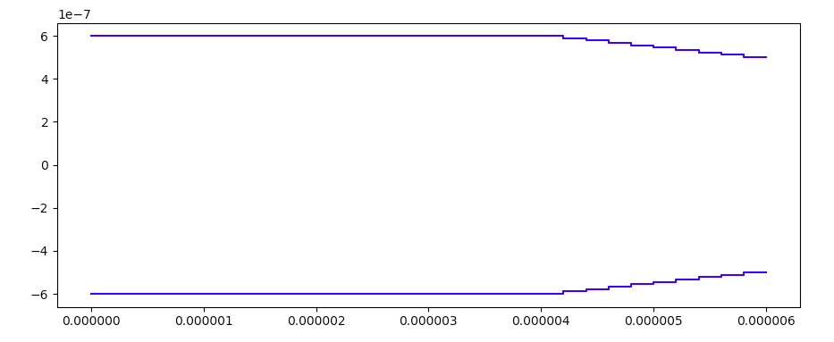
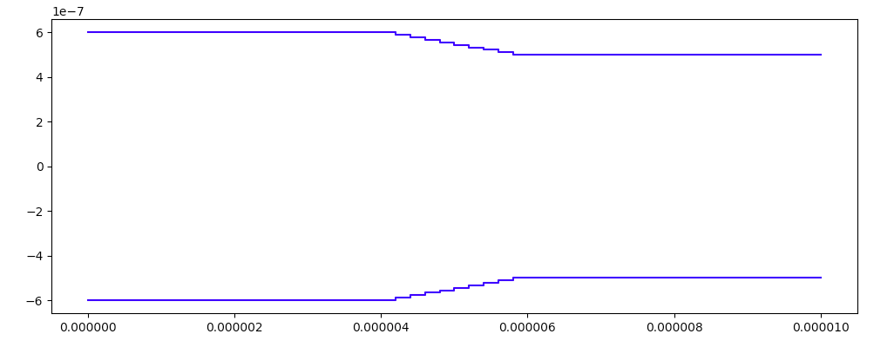

# Example: Taper

A tapered structure between two waveguides can be easy to simulate using EMEpy. The script for this example can be found [here](https://github.com/BYUCamachoLab/emepy/blob/master/examples/taper.py).

Begin by importing the EMEpy library and our modesolver.

    import emepy
    from emepy.fd import MSEMpy

    modesolver = MSEMpy  # Choose a modesolver object that will calculate the 2D field profile

We're going to simulate with a cross section mesh density of 256. Better results can be found with higher densities at the cost of a more expensive simulation. In addition, we'll perform the simulation with two modes to keep it simple.

    mesh = 256
    num_modes = 2

Let's go ahead and define the values for our dimensions. We'll define a larger waveguide that tapers into a smaller waveguide.

    width1 = 0.6e-6  # Width of left waveguide
    thickness1 = 0.4e-6  # Thickness of left waveguide
    width2 = 0.5e-6  # Width of right waveguide
    thickness2 = 0.3e-6  # Thickness of right waveguide

Eigenmode expansion operates in the frequency domain, so we need to define a specific frequency each time we run a simulation. For this example, let's only concern ourselves with a single wavelength.

    wavelength = 1.55e-6

Our final values to define involve our taper. We'll define a universal length to use for the taper and each waveguide of the simulation. Note, the length does not add to the simulation time at all for eigenmode expansion, so this value can be as big as we want.

    length = 10e-6  # Length of the waveguides
    taper_density = 10  # How many divisions in the taper where eigenmodes will be calculated
    taper_length = 2e-6  # The length of the taper

    wg_length = 0.5 * (length - taper_length)  # Length of each division in the taper

Lets import the rest of our classes as well as some other libraries to help us design our taper and see our results. We'll use numpy for some operations and plot our results using pylab.

    from emepy.eme import Layer, EME
    from emepy.mode import Mode

    import numpy as np
    import pylab

We need to define an EME object. Our options are EME and PeriodicEME. Because we don't have any periodic structures such as a grating, we will use the default EME object.

    eme = EME()

It's time to define our first section of our structure. This is the input waveguide connected to the taper. Because this structure is continuous in our direction of propagation, we only need to define a single modesolver object, and a single layer object to contain it.

    mode1 = modesolver(
        wl=wavelength,
        width=width1,
        thickness=thickness1,
        mesh=mesh,
        num_modes=num_modes,
    )
    straight1 = Layer(mode1, num_modes, wavelength, wg_length)
    eme.add_layer(straight1)

We can visualize a rough approximation of our geometry.

    eme.draw()

The next piece of our structure is the taper itself. We defined a taper_density to represent the number of discrete steps for our taper approximation. The higher this value, the more accurately our model represents a continuous taper. However, higher densities require more calls to our modesolver, which is the bulk of our computational expense. Let's create arrays to represent the widths and thicknesses of each discrete step of the taper, and also the length of each step. If our density is 0, we have a step between the waveguides with no taper between.

    widths = np.linspace(width1, width2, taper_density)
    thicknesses = np.linspace(thickness1, thickness2, taper_density)
    taper_length_per = taper_length / taper_density if taper_density else None

Let's create a modesolver and layer for each step of the taper and add them to our eme object.

    for i in range(taper_density):
        solver = modesolver(wl=wavelength, width=widths[i], thickness=thicknesses[i], mesh=mesh, num_modes=num_modes)
        taper_layer = Layer(solver, num_modes, wavelength, taper_length_per)
        eme.add_layer(taper_layer)

Again let's see what our geometry looks like now with our taper.

    eme.draw()

Finally we create another waveguide section just like before.

    mode2 = modesolver(wl=wavelength, width=width2, thickness=thickness2, mesh=mesh, num_modes=num_modes)
    straight2 = Layer(mode2, num_modes, wavelength, wg_length)
    eme.add_layer(straight2)

Let's take a look at our final geometry.

    eme.draw()

We're happy with our design, so now it's time to let the eme solver propagate. This will call our modesolver objects and solve for the modes, calculate mode overlaps at each interfact, and cascade the results together.

    eme.propagate()

Finally we can visualize the s parameters. Let's look at the absolute value which will tell us the power transmission and reflection per mode input.

    print(np.abs(eme.s_parameters()))

We can also look at the phase to know the output phase of each mode.

    print(np.angle(eme.s_parameters()))

We can use this to examine the results of specified inputs. For example, if we were to send in one mode on the left of our structure, we can see both the output phase and which output modes contain all the power.

    result = np.matmul(eme.s_parameters(),np.array([1,0,0,0]))

    print(np.abs(result))
    print(np.angle(result))
